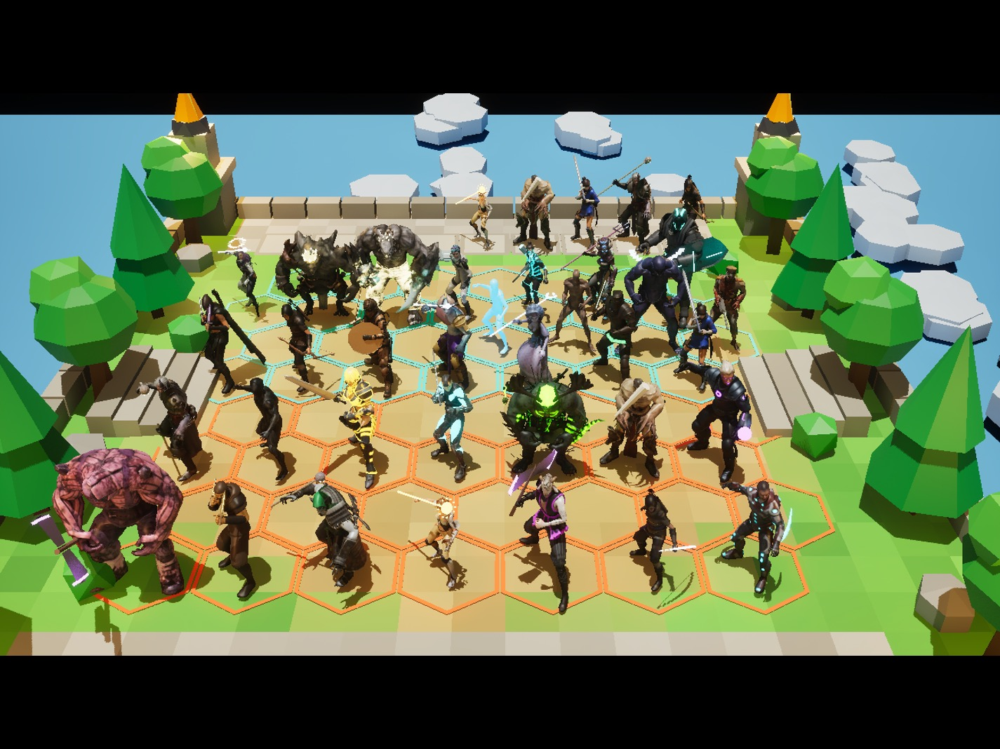

# Mixamo casting: which stand-in model plays which champion

The designer downloaded 48 Mixamo characters into `server/docs/examples/`. That folder is git-ignored: it holds about 2 GB of FBX, and Mixamo's licence allows the models inside a game but not redistribution of the raw files. This page gives every champion the closest one. For each hero it also notes what we still have to do to that model so it reads like the hero *and* its ability.
Previews: `casting/<id>_<Name>.jpg` (Blender Workbench renders, T-pose).

**How to read an entry**
- **Fit** says how close the model is out of the box. **good** = right silhouette and mood, just recolour and props. **ok** = right role, needs visible gear. **weak** = best we have, replace first when bespoke art comes.
- **Model work** lists the one-time changes: material tint or recolour, emissive glow, props attached to a bone (`mixamorig:RightHand`, `LeftHand`, `Head`, `Spine2`), and bone scaling for proportions.
- **Ability** lists what the fight has to show. That means which Mixamo animation to use and which effect the combat-log row triggers (`SpellCast` / `Attack` / `Damage` / `StatusApplied`, see UE5-Integration.md 7).

All Mixamo characters share the `mixamorig` skeleton, so one animation set drives everyone. Each hero only swaps the attack and cast clips from a small shared library: melee slash, heavy swing, punch, bow shot, gun shot, magic cast one-hand and two-hand, channel loop, buff/roar, leap and dash. Props are plain static meshes on hand sockets, built in Blender (`tools/blender/`, hard-surface is fine procedurally) or taken from free Fab packs.

**Colour key** (the synergy colours from `make_blockouts.py`): Helios orange/gold `F28C28`, Phaisa purple `7B3FBF`, Hexagon cyan `2EC4C6`, Coregons pale soul-green `9DB59A`, Selini moon-blue `5B7FD6`, Najmi cosmic (deep blue with star specks), Omnilium stone/crystal white.

---

## Tier 4-5 and the splash-art heroes first

### 9001 Alesk: Protector of Helios (4-cost Tank, Helios) → **Vanguard** (T. Choonyung)
Fit: **ok**. The splash art shows a massive dark-iron rune golem with a tower shield and teal glow. Vanguard is the bulkiest fully armoured, faceless body in the set, the only one that reads as a construct and not a man.
- **Model work:** recolour the tan armour plates to dark iron (desaturate and darken the albedo, keep the panel lines). Add teal emissive on the chest gem, the visor slit and rune strips (a mask texture over the plate seams). Scale the clavicles, upper arms and forearms by 1.25 and the spine by 1.1 so it towers like a golem, at about 1.2x unit scale. **Tower shield** on the `LeftHand` socket (Blender: a tall pointed kite shield with a teal rune crest), **short sword or none** in the right hand. The splash art is shield-first, a fist is fine too.
- **Passive, Helios Plating:** no animation. Show it as a gold rim light on the model at combat start. Scale the emissive by star level (1★ teal, 2★ brighter, 3★ gold-teal).
- **Ability, AESA (shield + damage reduction):** Mixamo "Standing Block Idle" or "Sword And Shield Block" as the cast clip, held for the shield duration (1.75/2/2.25 s). Effect: a translucent teal hex-dome (Hexagon style) around him plus a bright rune flash on the shield. The dome's opacity follows the shield HP from the `Damage` rows (`Absorbed`). Hits on the dome spark instead of making him flinch.
- **Attacks:** "Sword And Shield Slash" / "Shield Bash" (1.0 AS, melee).

### 9002 Baira: Purple Sniper (3-cost Damage, Phaisa, range 4) → **Nightshade** (J. Friedrich)
Fit: **good** for the splash art's sea sorceress: tall, horned crown, armoured dress, feminine, regal.
- **Model work:** recolour the dark gold and purple toward deep sea teal and violet (the splash art's blue plus Phaisa purple on the trim). Add a light blue emissive on the crown gem and eyes. **Coral trident** on `RightHand` (Blender: a branching staff with a glowing tip). A mermaid tail is not possible on this body, so skip it. Wet-look material (higher specular, low roughness) on the skin.
- **Passive, Wound:** a small dark-red "wound" icon floats on the target while it is wounded (status row).
- **Ability, Ardeat's Destiny (every 5th attack burns a 3-hex radius over time, plus attack speed):** her basic attack is a ranged trident bolt: Mixamo "Standing 1H Magic Attack 01" (wind-up to release) with a blue-violet projectile (flight time from the log). Show a small counter of 5 pips over her. On the 5th attack, cast clip "Standing 2H Magic Attack 03" and a violet tidal ring spreading 3 hexes that leaves a burning purple-water decal for the DoT duration (typed DoT `visual`). Show the attack-speed buff as a blue swirl on her arms for 5 s.

### 9014 Pyra: fire archer (1-cost Damage, Helios, range 4) → **Erika Archer With Bow Arrow**
Fit: **good**. It already carries a bow and quiver, and the hood, leather armour and female silhouette match the splash art.
- **Model work:** warm the leather toward bronze and red and give the bow limbs an orange emissive. The splash art has braids and no hood, so a hood-off variant would need a mesh edit; keep the hood for now. Add ember particles on the quiver.
- **Ability, Piercing Arrow:** "Standing Draw Arrow" + "Standing Aim Recoil" as the cast clip. Effect: a burning arrow with a fire trail that flies *through* the target to the hex behind (both hits are `Damage` rows at the same tick). Basic attack: the same bow clip with a normal arrow. The Helios burn from the trait shows as a small orange flame on the target.

### 9018 Rot: swamp treant (1-cost Damage, Coregons, range 3) → **Maw** (J. Laygo)
Fit: **good**. The antlers read as dead branches, and the hunched, heavy-armed monster matches Rot's bulk. No other model is a creature at this scale.
- **Model work:** recolour the fur and skin to wet black bark with moss green. Add toxic-green emissive on the mouth, eyes and drips (mask on the chest and hands). Add hanging moss or vine props on the antlers (static meshes on `Head`). Green fog particle aura at the feet.
- **Ability, Blight (poison, 120/180/280 over 3 s):** "Mutant Roaring" or "Zombie Scream" as the cast clip, spitting a green glob (projectile). On hit, the target gets the green Poison DoT colour (typed DoT `visual` = Poison) and dripping slime. Basic attack at range 3: "Zombie Attack" swipe that throws a smaller glob.

### 9010 Soul: The Lost Vessel (3-cost Tank, Coregons) → **Paladin** (J. Nordstrom)
Fit: **good**. Dark full plate and a great helm, exactly the splash art's cursed knight.
- **Model work:** rust and scuff the plate (albedo overlay). Green emissive in the visor slit and on rune plates on the chest and shoulders. Chains around the waist and spikes on the pauldrons (static props on `Spine2` / shoulders). **Rusty greatsword** on `RightHand` (Blender: a broad chipped blade).
- **Passive, Undying Shell (large permanent shield, cannot be healed):** a ghostly green shell shimmer on the armour whenever the shield is up, fading as it depletes. A small pulse of green soul particles flows *into* him on every attack (shield restored). Heals on him do not show, because he cannot be healed.
- **Ability, Soul Rend (damage + permanently steals AD and Armor):** "Great Sword Slash" or "Great Sword High Spin Attack". Effect: a green wisp is torn out of the target and flies into Soul. Each steal grows his green glow a step, stacking for the rest of the fight.

### 9015 Vex: Phaisa assassin (1-cost Damage, Phaisa + Assassin) → **Arissa**
Fit: **good**. Hood, cloak, lean rogue silhouette, the splash art's shadow assassin.
- **Model work:** recolour to black and purple (Phaisa). Purple emissive eyes under the hood. **Twin curved daggers** on both hands (Blender: short sickle blades). A trailing purple smoke ribbon on the cloak (particles).
- **Ability, Cull (blink to the lowest-HP enemy + strike):** hide the model, show a purple smoke puff at the old spot and a fresh one next to the target (the `Teleport` row), then "Sword And Shield Slash" / "Stabbing" with a purple slash arc. An Assassin crit shows a bigger number and a screen flash.
- **Attacks:** "Dual Dagger Slash" style clips (Mixamo "Standing Melee Attack Downward" works).

### 9006 Les: Wall of Omnilium (5-cost Tank, Omnilium + Protector) → **Mutant**
Fit: **ok**. Huge, hunched, with crystal growths on the arms and back. "First Matter" as crystal is a strong reading, and at 5-cost he should be the widest thing on the board.
- **Model work:** recolour the skin to grey stone. The crystal claws become Omnilium crystal: white-gold with emissive veins. Scale by about 1.3. A crystal plate slab on the back reads as the wall (static prop on `Spine2`).
- **Ability, Wall of Omnilium (roots 3 enemies, then Wall Mode: roots himself, huge defences, heals, allies in his row immune to CC):** cast clip "Mutant Roaring" + a ground slam ("Mutant Punch" into the ground). Crystal spikes erupt under the 3 rooted enemies (status `Root` rows). Wall Mode: he crouches in "Standing Block Idle", crystal plates rise in front of him, and a white-gold line runs along his row showing the CC immunity. The heal shows as a soft gold pulse per hit taken. When Wall Mode ends the crystals shatter.

### 9007 Lum: Guardian of Omnilium (5-cost Tank, Omnilium + Protector) → **Warrok** (W. Kurniawan)
Fit: **good**. A horned beast with enormous fists: Guardian's Punch is literally his ability, and the recipe asked for horns and a crown.
- **Model work:** stone-white and gold recolour (Omnilium), with gold emissive in the horn tips and knuckles. A crown or crest band on `Head`. Scale by about 1.2.
- **Passive, Omnilium Might:** combat start: gold crystal flecks settle on his armour (buff aura for the fight).
- **Ability, Guardian's Punch (heavy punch, the 2 hexes behind are hit and knocked up):** "Mutant Punch" or "Cross Punch". On impact, a shockwave cone runs 2 hexes behind the target and those units pop up (`Knockup` status: animate them rising 60 cm and falling over the duration). Camera shake at 3★.

### 9012 Vega: The Supernova (5-cost Damage, Najmi, range 4) → **Demon** (T. Wiezzorek)
Fit: **ok**. A blue-skinned, regal, otherworldly being with a cloak and gold jewellery reads as cosmic royalty. No other model is a proper star mage.
- **Model work:** push the skin to deep night-blue with a star-speck emissive mask. The cloak becomes a starfield material (panning stars). A small orbiting sun or planets prop (the recipe's "orbs"), rotating on a socket above the shoulders.
- **Ability, Starfall Channel (4 s channel, strikes every 0.5 s, board-wide nova if it completes):** "Standing 2H Magic Attack 05" into a looping channel ("Standing Idle" with arms raised, or Mixamo "Casting Spell 01" looped) for the channel duration. Each strike is a falling star onto a random enemy (the Damage rows give the targets). On completion the model flashes white, the camera flashes and a whole-board white-gold shockwave expands. If he is interrupted (stun/death) the orbs drop.

### 9031 Umbra: Eclipse (5-cost Tank, Selini) → **Ch25** (the dark muscular demon)
Fit: **ok**. A big, dark, hulking silhouette fits a Selini tank. Needs moon identity.
- **Model work:** night-blue skin with a silver rim light. A **crescent moon halo** behind the head (emissive static prop on `Head`). Moon-blue emissive eyes and veins. Scale by about 1.2.
- **Ability, Eclipse (magic damage to all enemies within 2 hexes + Blind for 3 s):** "Mutant Roaring" with arms spread. The halo goes black with a bright corona ring and a dark shadow disc sweeps 2 hexes (area shape from the log). Blinded enemies get a dark swirl over their eyes and their attack clips are suppressed.

### 9011 Myna: The Tidecaller (4-cost Damage, Selini, range 4) → **Peasant Girl**
Fit: **ok**. Long dress, headscarf and jewellery read as a mystic or tide priestess. Softer than the others, which suits a healer.
- **Model work:** recolour the dress to moon-blue and sea-foam. Silver jewellery with emissive. **Moon staff** on `RightHand` (Blender: a staff with a crescent top). Water droplets drifting around her feet.
- **Ability, Lunar Blessing (heals the lowest-HP ally, damages the highest-HP enemy near her target):** "Standing 2H Magic Attack 01". A tidal pool splash appears (the log's area), a blue healing wave rises under the ally (green number from the Heal row), and a water spear hits the enemy.

### 9028 Raa: Solar Leap (4-cost Damage, Helios + Assassin) → **Ch24** (the ninja)
Fit: **ok**. Agile masked assassin. Needs Helios gold and wings from the recipe.
- **Model work:** recolour the cloth to black and sun-gold with an orange emissive trim. Feathered solar wings on the back (static prop on `Spine2`, emissive gold). Two gold short blades.
- **Ability, Solar Leap (leap to the highest-HP enemy + big hit):** "Jump Attack" (Mixamo "Standing Jump" into "Stabbing"): arc through the air with a gold trail to the Teleport target, and the landing makes a sunburst. Crits are big (Assassin).

### 9029 Kryx: Frenzy (4-cost Tank, Phaisa) → **Pumpkinhulk** (L. Shaw)
Fit: **good**. A massive, rage-fuelled brute is exactly an attack-speed frenzy tank.
- **Model work:** recolour to purple-bruised skin and void-black cloth. Purple emissive veins that brighten in frenzy. Spikes on the shoulders (recipe). A two-handed **axe** on `RightHand`.
- **Ability, Frenzy (5 s: +50/75/150% attack speed, takes 10% more damage):** "Mutant Roaring" / "Warrior Battlecry", then a red-purple aura. **Play his attack clip faster** by the attack-speed gain (the play-rate code already times swings to the log), and add steam or vein pulsing.

### 9030 Mortis: Death's Volley (4-cost Damage, Coregons, range 4) → **Warzombie** (F. Pedroso)
Fit: **ok**. An undead officer, and the uniform suits a marksman.
- **Model work:** pale soul-green emissive eyes and wounds. **Bone crossbow or long rifle** on `RightHand` (the recipe said rifle). A ragged cape (recipe).
- **Ability, Death's Volley (next 3 attacks: bonus damage, ignore 50% Armor):** "Rifle Aiming Idle", then 3 empowered shots. The charged state shows as 3 green skull pips over his head. Each empowered shot gets a green comet trail and an armour-crack decal on the target.

---

## Tier 1-3

### 9003 Cyla: Eye of Hexa (2-cost Damage, Hexagon, range 4) → **Eve** (J. Gonzales)
Fit: **good**. Sci-fi officer with an **eyepatch** ("Eye of Hexa"). The model is short (1.39 m): scale it to match the others.
- **Model work:** cyan (Hexagon) trim emissive and a glowing cyan eyepatch lens. **Shoulder rocket launcher** (Blender: a tube on `RightShoulder`) plus a compact rifle in hand.
- **Ability, Rocket Strike (can attack while casting, rocket = 100% of her damage in the last 2 s, splash to adjacent):** do not interrupt the attack clip. Fire the rocket from the shoulder prop only (a smoke trail and a hex-shaped explosion on the target with a ring on the adjacent hexes). Scale the rocket's glow with the damage number.

### 9005 Faire: Arm of the Future (3-cost Damage, Hexagon, range 3) → **Ch48** (white spacesuit, blue hair)
Fit: **ok**. A clean future-tech woman. The "Arm" has to be built.
- **Model work:** a **big mech gauntlet** over the right forearm (Blender: a chunky armour sleeve with pipes, recipe "bigarm" + "pipes"), with cyan emissive. Scale the `RightForeArm` / `RightHand` bones by 1.4 so the arm reads.
- **Passive (attacks deal damage over 1 s; casts on death):** a cyan beam that lingers 1 s per attack. On death she plays the cast before her death clip.
- **Ability, Temporal Stun (magic damage, stun scales with recent damage, adjacent enemies stunned):** "Standing 1H Magic Attack 01" with the gauntlet. A clock-face or hex glyph freezes over the target, and grey time-freeze on the adjacent ones for 60% of the duration.

### 9008 Astra: Starbound Tether (1-cost Damage, Najmi, range 3) → **Pirate** (P. Konstantinov)
Fit: **ok**. Hooded, cloaked, a mysterious and graceful mystic.
- **Model work:** recolour the cloak to starfield navy with star specks. A small halo and gem on the forehead (recipe). Use the **Najmi star material** so she clearly matches Vega.
- **Ability (tether to the top-damage ally, 30% of that ally's damage redirected to her, +attack speed):** "Standing 1H Magic Attack 02". A glowing star-rope beam between her and the ally for 5 s, with a speed swirl on the ally's arms.

### 9009 Lunis: The Crescent Shadow (2-cost Damage, Selini + Assassin) → **Kachujin** (G. Rosales)
Fit: **good**. Female samurai/ninja with a blade-ready silhouette.
- **Model work:** recolour red to moon-blue and silver. A **crescent blade** (a curved katana) on `RightHand`.
- **Passive, Shadow Dive (jumps behind the farthest enemy, untargetable 2 s):** combat start: vanish into moon mist and appear behind the farthest enemy, semi-transparent (dithered opacity) for 2 s.
- **Ability, Crescent Slash (2-hex cone):** "Sword Slash 360" or "Great Sword Slash", with a crescent-shaped silver arc in the cone (area shape from the log). On a kill she fades to transparent for 1.5 s.

### 9013 Ignis: Ember Ward (1-cost Tank, Helios) → **Ch15** (riot / SWAT armour)
Fit: **ok**. Chunky armour, and a riot shield fits "ward".
- **Model work:** recolour the camo to bronze and ember-orange with emissive seams. **Round shield** on `LeftHand` and a short sword on the right (recipe).
- **Ability, Ember Ward (shield for 3 s):** "Sword And Shield Block". Ember particles circle him and the shield prop glows orange while the shield lasts.

### 9016 Null: Gravity Well (1-cost Tank, Phaisa, range 3) → **Dreyar** (M. Aure)
Fit: **ok**. Dark armoured man with white hair and a heavy silhouette. **This FBX is in centimetres (17 m tall in Blender): the import must scale it by 0.01.**
- **Model work:** void-purple trim emissive. A **black orb hovering over the palm** (recipe "orb_hover").
- **Ability, Gravity Well (magic damage + pulls the target 1 hex closer):** "Standing 1H Magic Attack" with a pulling gesture. A black-purple vortex on the target, which slides 1 hex toward him (Move row) along a dark distortion line.

### 9017 Bone: Skull Bash (1-cost Tank, Coregons) → **Skeletonzombie** (T. Avelange)
Fit: **good**. Gaunt, skeletal, with rotting cloth. His name says bone.
- **Model work:** bleach the bones with soul-green eye glow. A **bone club** on `RightHand`, and skulls and horns on the shoulders (recipe).
- **Ability, Skull Bash (damage + 1.5 s stun):** "Zombie Attack" overhead into a club smash, a bone-crack impact and stun stars / a green skull over the target.

### 9019 Bit: Breakthrough (1-cost Tank, Hexagon) → **Exo Gray**
Fit: **good**. Muscular exo-suit, fast and tech.
- **Model work:** cyan emissive on the suit lines (Hexagon), a helmet visor (recipe "helm"), a short tech blade.
- **Ability, Breakthrough (dashes through the target to the hex behind):** "Running Tackle" / "Shoulder Charge" (Mixamo "Football Tackle") along the Teleport path. A cyan afterimage trail, and the target is knocked aside.

### 9020 Solis: Solar Strike (2-cost Tank, Helios) → **Maria WProp** (J.J. Ong)
Fit: **good**. Gold armour and she already holds a sword: pure Helios.
- **Model work:** push the gold toward sun-gold with an emissive edge. The sword becomes a **greatsword** (a bigger prop, recipe), or keep hers and scale it by 1.5.
- **Ability, Solar Strike (next attack empowered, shreds 20% Armor):** "Great Sword Idle" charge (glowing blade) until the empowered swing ("Great Sword Slash"), then a sun-flare impact and a cracked-armour icon on the target for 3 s.

### 9021 Xul: Void Bolt (2-cost Damage, Phaisa, range 4) → **Ch44** (sleek black android)
Fit: **ok**. Faceless, glossy black: reads as a void entity.
- **Model work:** replace the orange visor line with void-purple emissive. A floating orb and a pointed hat-like crest (recipe) are optional; the faceless look already works.
- **Ability, Void Bolt (bolt that bounces to 1 adjacent enemy):** "Standing 1H Magic Attack 01", a purple bolt with a black core, and a second bolt from the first target to the bounce target (two Damage rows).

### 9022 Grave: Raise Skeleton (2-cost Damage, Coregons, range 3) → **Ganfaul** (M. Aure)
Fit: **good**. A white-haired horned warlock with a clawed arm and a long coat: a necromancer.
- **Model work:** soul-green emissive on the claw arm and eyes. A **skull staff** on `RightHand` (recipe), and spikes and skulls on the belt.
- **Ability, Raise Skeleton:** "Standing 2H Magic Attack 04" aimed at the ground. A green rune circle on the spawn hex, then the Skeleton summon (below) rises ("Zombie Stand Up" / "Getting Up" clip on the summon's Spawn row).

### 9023 Byte: Firewall (2-cost Damage, Hexagon, range 3) → **Ely** (K. Atienza)
Fit: **good**. Sci-fi armour with light strips: an engineer or support.
- **Model work:** turn the orange lights cyan. A **small wrist shield generator** (recipe shield + wand) on `LeftHand`.
- **Ability, Firewall (shield on the lowest-HP ally):** "Standing 1H Magic Attack". A cyan hex-grid wall wraps the ally for 3 s (Hexagon style, like Alesk's dome but thinner).

### 9024 Orion: Concussive Shot (2-cost Damage, Najmi, range 4) → **akai** (E. Espiritu)
Fit: **ok**. Hooded archer with a quiver (bow prop needed).
- **Model work:** Najmi star material on the cloak, a **star-metal bow** on `LeftHand`, and silver-blue wings (recipe). If they clutter the silhouette, drop them.
- **Ability, Concussive Shot (damage + knock back 1 hex):** "Standing Draw Arrow". A heavy blue arrow with a shockwave ring on impact, and the target slides back 1 hex (Move row).

### 9025 Nyx: Cleave (3-cost Tank, Phaisa) → **Ch40** (goat-skull mask, black and gold)
Fit: **ok**. The horned mask fits the recipe's horns and reads as menacing. A bruiser needs more bulk.
- **Model work:** gold to purple, emissive eye holes, scale the shoulders by 1.2. A **big double-bladed glaive or axe** (recipe had daggers; the axe reads as "cleave").
- **Ability, Cleave (all adjacent enemies):** "Great Sword High Spin Attack", a full 360° purple arc on the 6 surrounding hexes.

### 9026 Flare: Sunbeam (3-cost Damage, Helios, range 4) → **Medea** (M. Arrebola)
Fit: **weak**. The right gender and energy for a sun mage, but the outfit is an adventurer's. **This FBX is tiny (0.165 m): the import has to fix the scale.**
- **Model work:** recolour to white and sun-gold, with a gold sun crest on the head (recipe crest), a **sun staff**, and a warm emissive. A robe skirt would need a mesh add, so skip it for now.
- **Ability, Sunbeam (1-hex radius):** "Standing 2H Magic Attack 02" pointing up. A pillar of light slams down on the target area (the log's area shape) with scorch decals.
- Replace first when bespoke art comes.

### 9027 Lich: Soul Drain (3-cost Damage, Coregons, range 3) → **Vampire** (A. Lusth)
Fit: **good**. Pale blue skin, hood, glowing blue eyes: a draining undead.
- **Model work:** soul-green eyes instead of blue, a small bone crown (recipe), a **staff** on `RightHand`.
- **Ability, Soul Drain (2 s drain, heals himself 100%):** "Standing 1H Magic Attack" held as a channel. A green soul stream flows target → Lich for 2 s, with the damage ticks (DoT `Drain` visual) and green heal numbers on him.

---

## Summons and PvE monsters (optional, same pipeline)

| id | unit | model | notes |
|---|---|---|---|
| 9101 | Skeleton (Grave's summon) | **Ch30** (flayed creature) | Bleach to bone, green eyes; rises with "Getting Up" on Spawn. |
| 9102 | Lost Soul (Coregons, untargetable) | **Ch36** (the plain mannequin) | Translucent ghost material (fresnel soul-blue, no texture) and a hover height of 40 cm. It never attacks visually, only its echo damage shows as a blue wisp. |
| 10001 | Gloop | **Parasite** (L. Starkie) | Slime-green recolour. |
| 10002 | Spitter | **Zombiegirl** (W. Kurniawan) | Spit-glob projectile. |
| 10003 | Boulder | **Brute** | Stone texture, huge scale. |
| 10004 | Elder Wraith | **copzombie** or **Yaku** | Dark ghost material. Weak fit, placeholder. |

Unused spares: Ch10, Ch11, Ch20, Ch22, Ch33, Ch34 (the green leaf elf, a candidate for a future nature hero), Ch39 (cartoon wizard, style mismatch), Ch45, Ch47, exo_red, Lola, Yaku. Duplicates on disk: `Dreyar (1)`, `Parasite (1)`, `Skeletonzombie (1)`. Two downloads were unfinished (`*.crdownload`) when this was written.

---

## Technical notes for the import

- **Scale:** most FBX are 1.7-2.4 m. **Dreyar is in cm (17 m), Medea is 0.165 m and Pirate is 0.647 m**: the import script normalises each model to a target height per champion.
- **Skeletons:** every model uses `mixamorig`. Most have 65 bones, but some add hair, cloth or cape bones (Exo 112, Ganfaul and Vampire 99, Warrok 81, Demon 79). Import the first character as the base skeleton and merge the rest into it; UE adds the missing bones. Otherwise keep a skeleton per model and use a shared IK Retargeter. Both work. Merging keeps one animation set without retargeting.
- **Polycount:** the Mixamo originals go up to 59k triangles (the `Ch*_nonPBR` ones have 4096² textures and 25-59k triangles). TFT standard is ≤ 8k per champion, so generate LODs in UE (LOD0 ~15k is fine at our camera distance on Mac; reduce later for mobile). Downscale the textures to 2048.
- **Animations still needed** (download "Without Skin", 30 fps, "In Place"): idle, run, death, hit, victory, plus the attack and cast clips named above. Grouped into a shared library: sword-and-shield slash + block, great-sword slash + spin, dual-dagger stab, punch (mutant punch), bow draw + shoot, rifle aim + shoot, 1H magic attack, 2H magic attack, casting loop (channel), battlecry/roar, jump attack, tackle/charge, zombie attack, getting up. About 20 clips cover all 30 heroes.

---

## Built: every champion animated in Unreal (2026-09-25)

**Pipeline** (all automatic; the Mixamo files stay outside git):
1. `~/w2f_bpy/venv/bin/python tools/mixamo/build_heroes.py [--only 9001,9014] [--preview]` (Blender as a module). Configured by `tools/mixamo/config.json`. It takes about 30 s for all 32 heroes when 6 builds run in parallel, one `--only` per process. Each hero goes through these steps:
   - rename the bones to `mixamorig:` (some downloads say `mixamorig1:` / `mixamorig5:`),
   - scale to the target height (Dreyar came in at 17 m and Medea at 0.17 m),
   - apply the look edits,
   - decimate to at most 20k triangles and cap textures at 2048,
   - copy every clip the hero uses onto its own armature: local rotations 1:1, the hips translation rescaled to the hero's hip height, horizontal drift removed so clips play in place,
   - export `SourceArt/Mixamo/<id>_<Name>/SKM_*.fbx` inside the UE project, plus the textures, a `visual.json` and a preview strip. The strip shows five frames: idle, attack at impact, cast at impact, run, and the end of death.
2. `UnrealEditor-Cmd <uproject> -run=pythonscript -script=tools/unreal/import_heroes.py` (editor closed; `W2F_ONLY=9001` limits it). Each hero is imported to `/Game/W2F/Heroes/<id>_<Name>/` with its own skeleton and one AnimSequence per clip. Each material slot becomes a material instance, `M_CraftedPBR` for the body or `M_W2FSolid` for props. `unit_visuals.json` is copied to `Content/W2F/Data/`.
3. AW2FArena spawns a skinned hero wherever `unit_visuals.json` has one, and falls back to the static models otherwise; `-w2fstatic` turns the skinned heroes off. `UW2FUnitAnim` is a native anim instance with no Animation Blueprint: the arena picks the clip and its time every frame from the combat log. For an Attack or SpellCast row, the clip's own wind-up is stretched or squeezed (0.6x-3x) so its impact frame lands on the row's tick, then the rest of the clip plays out. A cast marked `hold` (Alesk's block) freezes for the row's duration. Blows bigger than 4% of max HP make the hero flinch. After the death clip the hero sinks into the ground, and the winners play `victory`.
4. Dev views:
   - `-w2fgallery`: all heroes on the board, as in the picture above,
   - `-w2fshowcase=<id>`: one hero up close,
   - `-w2ffight=<n> -w2ffocus=<id>`: replay sample fight n with the camera on one unit,
   - `-w2fshots=N -w2fshotevery=S`: a series of screenshots.

**Clip library** (`clips` in the config; about 50 clips from the downloaded packs, all verified frame by frame):
- **Sets:** `sword`, `magic`, `fight`, `bow`, `mutant`, `zombie`. Each set bundles idle, run, flinch, death and victory.
- **Attacks and casts:** each hero picks its own, listed below.
- **Timing:** the impact second of each clip is found automatically from the fastest-moving hand or foot. Override it in the config with `impact` if it looks wrong.

| hero | set | attack | cast | props |
|---|---|---|---|---|
| 9001 Alesk | sword | `atk_sword` | `cast_block` (held) | tower shield (dark iron, teal runes) |
| 9002 Baira | magic | `atk_magic` | `cast_wave` | coral trident |
| 9003 Cyla | bow | `atk_rifle` | `atk_rifle` (attacks while casting) | rifle, shoulder rocket |
| 9005 Faire | magic | `atk_magic2` | `cast_1h_kneel` | mech gauntlet |
| 9006 Les | mutant | `atk_swipe` | `cast_roar` | – (crystal glow) |
| 9007 Lum | mutant | `atk_punch` | `cast_slam` | crown |
| 9008 Astra | magic | `atk_magic` | `cast_1h` | halo, star staff |
| 9009 Lunis | fight | `atk_slash` | `cast_sweep` | moon blade |
| 9010 Soul | sword | `atk_heavy` | `cast_rend` | rusty greatsword |
| 9011 Myna | magic | `atk_magic2` | `cast_2h` | crescent staff |
| 9012 Vega | magic | `atk_magic` | `cast_channel` | star staff |
| 9013 Ignis | sword | `atk_slash` | `cast_powerup` | sword, round shield |
| 9014 Pyra | bow | `atk_bow` | `cast_arrow` | (her own bow) |
| 9015 Vex | fight | `atk_stab` | `cast_daggers` | twin daggers |
| 9016 Null | magic | `atk_magic` | `cast_2h_push` | void orb |
| 9017 Bone | zombie | `atk_zombie` | `cast_headbutt` | bone club |
| 9018 Rot | mutant | `atk_swipe` | `cast_roar` | – (toxic glow) |
| 9019 Bit | fight | `atk_sword` | `cast_dash` | tech blade |
| 9020 Solis | sword | `atk_heavy` | `cast_raise` | (her own sword) |
| 9021 Xul | magic | `atk_magic2` | `cast_1h_kneel` | – (void glow) |
| 9022 Grave | magic | `atk_magic` | `cast_summon` | skull staff |
| 9023 Byte | magic | `atk_magic2` | `cast_1h` | – (cyan lights) |
| 9024 Orion | bow | `atk_bow` | `cast_arrow` | star bow |
| 9025 Nyx | sword | `atk_heavy` | `cast_cleave` | double axe |
| 9026 Flare | magic | `atk_magic` | `cast_area` | sun staff |
| 9027 Lich | magic | `atk_magic2` | `cast_drain` | skull staff |
| 9028 Raa | fight | `atk_stab` | `cast_leap` | gold daggers |
| 9029 Kryx | mutant | `atk_heavy` | `cast_roar` | big axe |
| 9030 Mortis | zombie | `atk_rifle` | `cast_scream` | rifle |
| 9031 Umbra | mutant | `atk_swipe` | `cast_area` | crescent moon |
| 9101 Skeleton | zombie | `atk_zombie` | – | – |
| 9102 Lost Soul | magic | `atk_magic` | – | – (blue ghost) |

**Look edits** (`look` in the config):
- **Recolour:** `recolour` in `metal` or `tint` mode.
- **Colour swaps:** `swaps` moves one colour family (red, orange, yellow, green, blue, purple) to a new hue and keeps the shading.
- **Glow:** `glow` turns one colour family into an emissive mask in the synergy colour.
- **Bone proportions:** `scale_bones` changes proportions and bakes them into a new rest pose.
- **Props:** chosen from the library in `build_heroes.py`: tower_shield, sword, greatsword, dagger, axe, staff with an orb / crescent / skull / sun / star top, trident, bow, rifle, club, gauntlet, round_shield, halo, crescent, crown, orb, rocket. Each is placed by slot (right_hand, left_hand, left_arm, right_arm, head, behind_head, crown, over_left_palm, right_shoulder).

**Still to do per hero** (the notes above say what each ability should look like): the ability VFX are not built yet, meaning projectiles per hero, area shapes, shields, tethers and so on. Today's viewer still draws the generic debug shapes for them. After that come per-hero detail passes on the props and on proportions (bone scale). Finally, bespoke art replaces a Mixamo body: rig it on Mixamo and drop it in through the same pipeline.

---

## Fight effects (2026-09-25)

Every basic attack and every ability has an effect, and so do the log's own reactions. It is built without Niagara, from 14 effect meshes (`tools/mixamo/build_fx_meshes.py` → `/Game/W2F/FX`) and two materials, both built by `tools/unreal/import_fx.py`:
- **`M_W2FFx`**: additive, for glows, projectiles and bursts.
- **`M_W2FFxDark`**: translucent tint, for ground rings, pools, slashes and shadows, so the colour survives on the bright board.

The player is `UW2FFx` (`Source/work2fightgame/W2FFx.*`): pooled mesh components moved, scaled and faded on the **fight clock**, so every effect follows the playback speed and lands on the log's impact tick. Which effect a champion uses is data: `tools/mixamo/fx.json`, copied to `Content/W2F/Data/unit_fx.json`. A `brightness` value there is the single knob for every glow.

- **Basic attacks** (`attack`):
  - Melee, drawn at the impact tick: `slash`, `heavy` (a big arc plus a ground crack), `stab`, `punch` (a burst plus a shock ring), `claw` (three arcs), `smash` (a ring plus debris).
  - Ranged, flying from the release to the impact tick: `arrow`, `bolt`, `bullet` (a tracer plus a muzzle flash), `glob` (arcing), `orb`.
- **Abilities** (`cast`), one recipe per ability in `W2FFx.cpp`. Anything that must land on the tick (rockets, bolts, arrows, globs) leaves at the start of the cast's windup. Every cast also gets a charge glow in the caster's hand and its area (circle, cone, line, whole board) glowing on the ground.

  | champion | effect |
  |---|---|
  | Alesk | rune ring and swirl |
  | Baira | violet tide over 3 hexes, burning water |
  | Cyla | arcing rocket and explosion |
  | Faire | clock glyph over the target |
  | Les | Omnilium crystals around him during Wall Mode |
  | Lum | shock rings running behind the target |
  | Astra | star flare |
  | Lunis | one wide crescent across the cone |
  | Soul | heavy blow, and a soul wisp flies back to him |
  | Myna | tidal pool, water spears on the struck enemy |
  | Vega | channel crown and orbiting stars; a star falls on every strike; a board-wide nova if the channel completes (it fades if she is interrupted) |
  | Ignis | ember swirl |
  | Pyra | flaming arrow through the target, burning line |
  | Vex | X-slash |
  | Null | black hole |
  | Bone | bone-cracking smash |
  | Rot | toxic glob and splash |
  | Bit | cyan dash impact |
  | Solis | sun charge, a flare on the empowered blow |
  | Xul | void bolt that visibly bounces to the second victim |
  | Grave | necromantic flare and summoning circle |
  | Byte | shield projector |
  | Orion | star shot and shock ring |
  | Nyx | full circle of steel |
  | Flare | sunbeam pillar |
  | Lich | soul stream from the victim into him for 2 s |
  | Raa | leap trail and sunburst landing |
  | Kryx | roar |
  | Mortis | skulls load his shots, a flare on each empowered shot |
  | Umbra | the eclipse: black moon, corona, shadow on the ground |

- **Reactions straight from the log**, in the colour of the unit that caused them. These look the same for every hero:
  - Shields (`ShieldApplied`/`Ended`): a dome, which shatters when broken.
  - Statuses, per the `statuses` table in fx.json:
    - Stun: circling stars.
    - Root: spikes at the feet.
    - Knock-up: the unit actually rises; that lift is done by the arena.
    - Blind: a dark orb over the head.
    - Tether: a beam, which is Astra's link.
    - Attack-speed buff: a swirl, which is Kryx's frenzy.
    - Empowered attack: orbiting charges.
    - Untargetable / aggro drop: a shimmer.
    - CC immunity: a gold ward ring.
  - Damage-over-time ticks (Burn / Poison / Bleed / Drain): puffs in their own colour.
  - Heals: green motes.
  - Crits: a white flash.
  - Teleports: a streak for pulls and knock-backs; otherwise the unit's `move`, which is `blink` (puffs), `dash` (Bit: slide plus streak) or `leap` (Raa: an arc in the air plus a landing ring).
  - Deaths: a ring and debris.
  - Summons: a circle and a pillar.
- **Checking it:** `docs/sample_fights/05-everyone-else.json` is a new sample fight, recorded by `make sample-fights`. It holds the ten champions the other files leave out, so fights 01-05 together contain every champion's attack and ability.
  - Dev flags: `-w2ffight=N -w2fshotticks=t1,t2,... -w2ffocusseq=id1,id2,...` take a close-up screenshot of a given champion at given fight ticks.
  - I reviewed all 30 abilities and the basic attacks this way. Colours and shapes read correctly, and the screenshots were taken on the Mac, not in a playtest.

### Polish pass (2026-09-25, "TFT feel")
- **Soft sprites:** 8 procedural textures from `build_fx_meshes.py`: glow, spark, ring, shock, smoke, streak, flare and rune circle. They are drawn as camera-facing (or flat) quads by instanced components, with colour and alpha per instance. There is an additive material `M_W2FSprite` and a tinted one, `M_W2FSpriteTint`, which keeps the hue on the sand.
- **Particles:**
  - sparks with velocity, gravity, drag and stretch along the motion,
  - smoke puffs,
  - glowing trails behind everything that flies, with a bright head,
  - motes of power converging into the caster's hand during the windup,
  - rune circles under summons and Alesk's ward.
- **Impacts:** every burst is now a soft bloom, a white-hot core, a spark spray and a shock ring. Big bursts also light up the ground and the units with a short point-light flash (a pool of up to 12 lights).
- **Hit flash:** heroes blink white for a moment when struck. The `Flash` / `FlashColour` parameters of `M_CraftedPBR` are rebuilt with `tools/unreal/rebuild_materials.py`.
- **Camera shake:** on the heavy hitters (Lum's punch, Umbra's eclipse, Les' wall, Raa's leap, Flare's sunbeam and so on).
- **Honest limit:** this is still procedural. TFT's hand-painted flipbooks, stylised meshes and per-champion sound design need an artist. The system is ready for them: swap a texture, or add a recipe in `W2FFx.cpp` / a line in `fx.json`.

---

## September 2026 champions (GDD additions)

| id | champion | model | set | attack / cast | props |
|---|---|---|---|---|---|
| 9032 | Tide (Selini bruiser) | Brute | sword | `atk_punch` / `cast_powerup` | water shield (+ his own axe) |
| 9033 | Sunna (Helios support) | Lola | magic | `atk_magic` / `cast_1h` | sun staff, halo |
| 9034 | Kael (Helios bruiser) | exo_red (gold swap) | sword | `atk_heavy` / `cast_slam` | sun-hammer (new `hammer` prop) |
| 9035 | Aphel (Selini marksman) | Ch47 (moon-blue swap) | bow | `atk_bow` / `cast_arrow` | moon bow, crescent |
| 9036 | Sola (Selini assassin) | Ch45 | fight | `atk_slash` / `cast_combo` (new clip: Standing Melee Combo Attack Ver. 3) | moon blade + dagger |
| 9037 | Morrah (Phaisa mage) | Ch39 (void tint) | magic | `atk_magic2` / `cast_area` | void orb staff |
| 9038 | Aureon (Helios 5-cost) | Ch20 (gold swap) | magic | `atk_magic` / `cast_area` | sun staff, crown, halo. Weakest match: replace first |
| 9039 | Nihila (Phaisa 5-cost) | Ch34 (void tint) | magic | `atk_magic2` / `cast_channel` | void crown, dark orb |

Effects: `crashing_tide` (Baira), `riptide`, `morning_light`, `dawnbreaker`, `moonlit_volley`, `moon_waltz` (plus hit style `slash`), `rift_collapse`, `solar_judgment` (the sun sinks for 1.5 s, then falls) and `devour_reality` (the board darkens for the channel, then a void nova). New hit styles are `wave` and `slash`. Teleport `subtype` 2 draws Lunis's assist blink: a streak there and back, a slash in his colour, and his swing animation.

Portraits: every build also renders `T_Portrait_<id>.png`, a head-and-shoulders EEVEE shot on a transparent background. `import_heroes.py` puts it over the generated bust in `/Game/W2F/Icons`.

## Trait system v2 units (2026-09-25)

Built with the same pipeline (`tools/mixamo/config.json`, `build_heroes.py`); new props in the library: `antlers`, `leaf_crown`, `canopy`, `claws`, `gatling`,
`pauldron`, `mech_pack`, staff tops `flower` / `leaf`; new slots `left_shoulder`, `back`. Mixamo has no tree rigs, so the plants are humanoids with bark
tints, canopies and antlers. **Do not use `scale_bones` on the `Ch*_nonPBR` rigs**: it breaks their height normalisation (hips end up at ~0.65 of the height);
use `height` instead.

| id | unit | model | look |
|---|---|---|---|
| 9040 | Rivet (Gunslinger) | Ch33 | leather tint, gatling, shoulder guard |
| 9045 | Hexa (mech) | Ch11 (hazmat) at 2.6 m | gunmetal, cyan glow, two gauntlets, mech backpack, shoulder rocket |
| 9046 | Moss | Parasite | moss tint, bark pauldrons, bark round shield |
| 9047 | Thorn | Zombiegirl | bark tint, green bow, leaf crown |
| 9048 | Briar | Yaku | thorn sword + dagger, bark pauldron |
| 9049 | Fern | Ch22 | green, flower staff, leaf crown |
| 9050 | Oakheart | Ch10 at 2.4 m | bark, antlers, club |
| 9051 | Willow | Eve (duplicate) | willow green, leaf staff, leaf crown |
| 9052 | Sylva | Erika Archer (duplicate) | forest recolour, starlit bow, halo, leaf crown |
| 9053 | Talon | copzombie | feral bark tint, glowing claws, small antlers |
| 9054 | Yggra | Warrok (duplicate) at 2.9 m | bark, canopy + antlers, bark pauldrons |
| 9041 | Rift Herald | Mutant (duplicate) | void purple, horns |
| 9043 | Phaisa Queen | Demon (duplicate) at 3.0 m | void purple, crown, claws |
| 9042 | Baron Nashor | Parasite (second copy) at 3.1 m | void purple, great horns |
| 9044 | Invention | Exo Gray (duplicate) at 1.5 m | gold metal, backpack, halo, rocket |
| 9110 | Stonebark Tree | Pumpkinhulk (duplicate) | bark, canopy, antler branches |
| 9111 | Omnilium Blossom | Ch22 (duplicate) at 1.2 m | pink-white, petal crown, Omnilium orb |
| 9112 | Omnilium Protector | Paladin (duplicate) | mossy metal, Omnilium glow, tower shield, leaf crown |

Viewer: the `07-trait-system-v2` sample fight; a pilot is hidden while it has `Piloting`; new cast recipes in `W2FFx.cpp` (shred_volley, overdrive, barkskin,
bramble_shot, thornwhirl, verdant_bloom, uproot, weeping_grove, starseed, pounce, heart_of_forest, bulwark_roar, void_torrent, void_maw) and Cyla's
Fishbones rockets (hit `rocket`).
